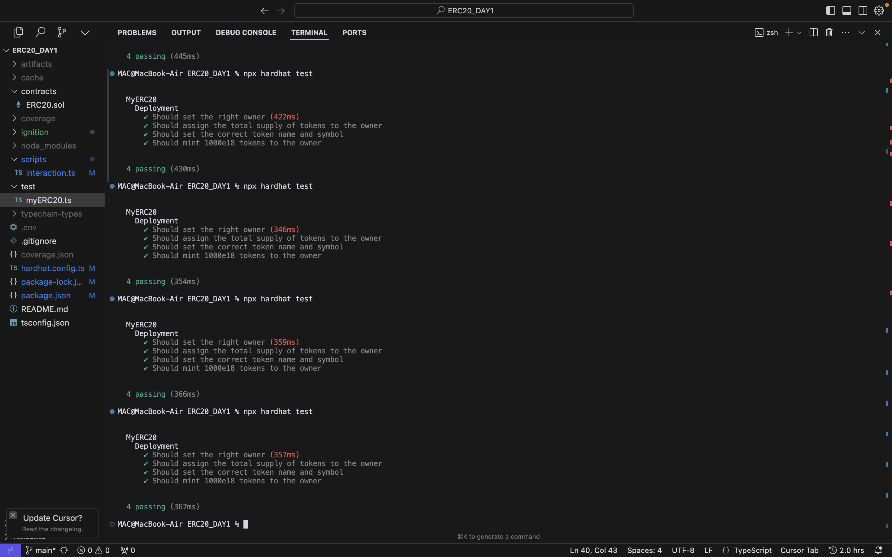
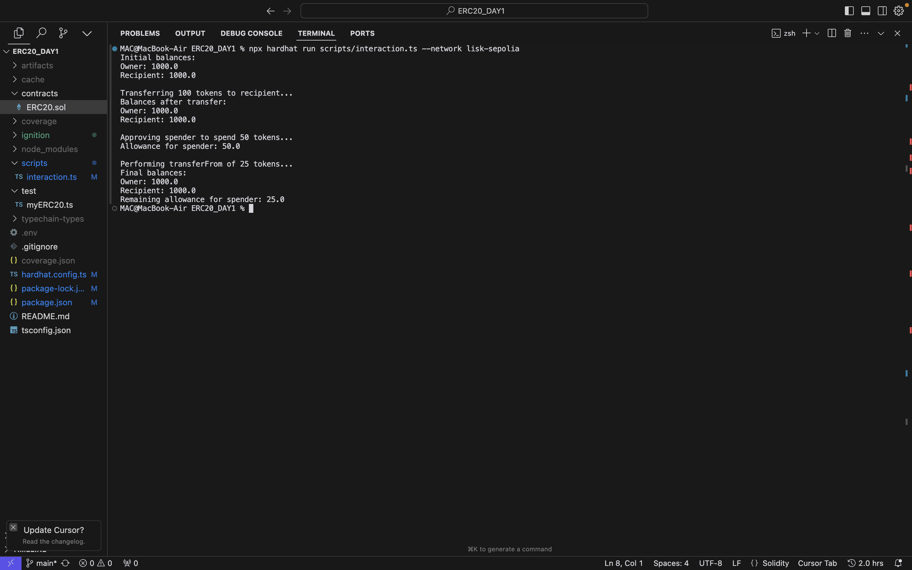

# Day 1: ERC20 Token with Hardhat and Sepolia Testnet

## 30 Day Smart Contract Solidity Challenge

This project is part of the 30 Day Smart Contract Solidity Challenge. It represents the Day 1 challenge, focusing on creating an ERC20 token, writing Hardhat tests, and deploying to the Sepolia testnet.

## Overview

This project demonstrates the implementation of an ERC20 token using Solidity, along with comprehensive Hardhat tests and deployment to the Sepolia testnet. It serves as a practical introduction to token creation, testing, and interaction with Ethereum testnets.

## Features

- ERC20 token implementation
- Hardhat test suite for the token contract
- Deployment scripts for Sepolia testnet
- Live interaction examples with the deployed token

## Screenshots


### Test Suite Execution



### Token Interaction on Sepolia


## Prerequisites

- Node.js (v14.0.0 or later)
- npm (v6.0.0 or later)
- Metamask wallet with Sepolia ETH

## Installation

1. Clone the repository:
   ```
   git clone https://github.com/Osiyomeoh/ERC20_DAY1.git
   cd ERC20_DAY1
   ```

2. Install dependencies:
   ```
   npm install
   ```

3. Create a `.env` file in the root directory and add your Sepolia RPC URL and private key:
   ```
   SEPOLIA_RPC_URL=your_sepolia_rpc_url
   PRIVATE_KEY=your_wallet_private_key
   ```

## ERC20 Token Contract

The ERC20 token contract is located in `contracts/MyToken.sol`. Key features include:

- Standard ERC20 functionality (transfer, approve, transferFrom)
- Minting function (restricted to owner)
- Burning function

## Hardhat Tests

To run the test suite:

```
## Day 1 Challenge Completion

In this Day 1 challenge, we've successfully:
1. Implemented an ERC20 token contract
2. Written and executed Hardhat tests
3. Deployed the token to Sepolia testnet
4. Demonstrated live interaction with the deployed token

## Next Steps

- Add more advanced features to the token (e.g., pausable, capped supply)
- Implement a frontend for interacting with the token
- Explore integrating the token with a simple DeFi application

## Contributing

Contributions are welcome! Please feel free to submit a Pull Request.

## License

This project is licensed under the [MIT License](LICENSE).

## Acknowledgements

- [OpenZeppelin](https://openzeppelin.com/) for ERC20 implementation
- [Hardhat](https://hardhat.org/) for Ethereum development environment
- [Sepolia Testnet](https://sepolia.dev/)
- [30 Day Smart Contract Solidity Challenge]
